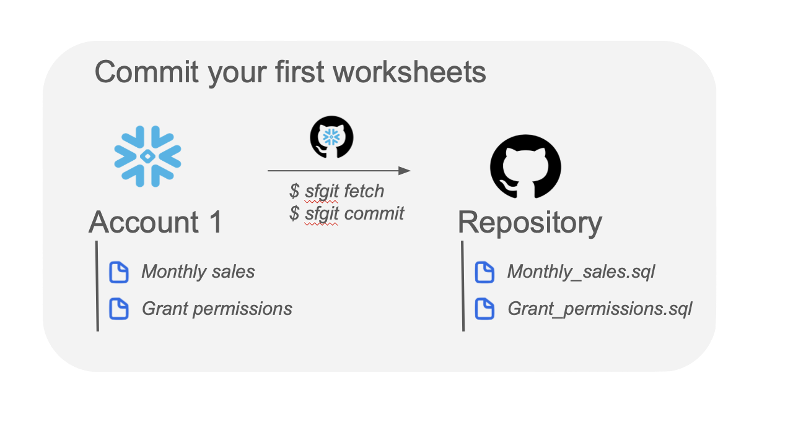
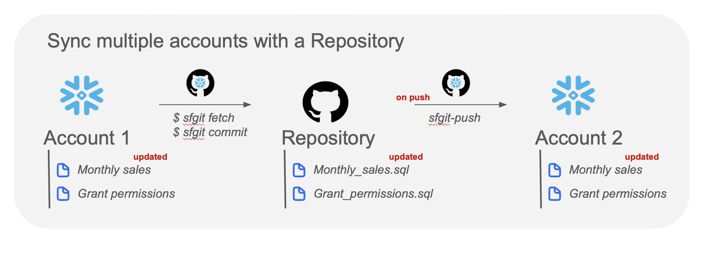
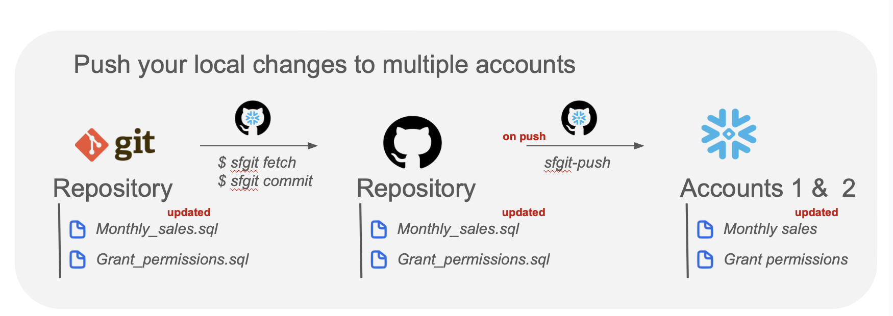
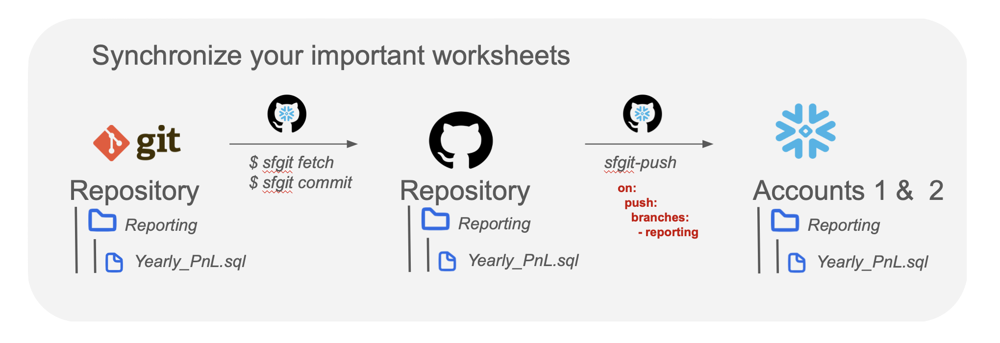

<p align="center">
  
</p>

[](mailto:thomas.dambrin@gmail.com?subject=[GitHub]%20Snowflake%20Git%20Versioning)
[](https://opensource.org/licenses/MIT)

# Push your worksheets to Snowflake via GitHub Actions
## sf-push

This composite action leverage the [sf_git](https://github.com/tdambrin/sf_git) package to **push your tracked worksheets to your Snowflake account(s).**

## Getting started
### Requirements
What you need to set up smooth synchronization between your GitHub repository and your Snowflake account:
- A snowflake account with password authentication
- Account and authentication parameters set in your GitHub repository secrets
- Worksheets previously fetched with the [sf_git](https://github.com/tdambrin/sf_git) CLI. This action uses the metadata created by this package.

### 1. Set up your account and authentication parameters

In your GitHub repository secrets, set all three variables:
- ACTIONS_SF_ACCOUNTS
- ACTION_SF_USERNAMES
- ACTION_SF_PASSWORDS

To push to several accounts, simply set the secrets to comma separated values while keep a consistency with the order.

Exemple:

    ACTIONS_SF_ACCOUNTS: myaccount1.eu-west-1.aws, myaccount2.east-us-2.azure
    ACTIONS_SF_USERNAME: John, Linda
    ACTIONS_SF_PASSWORDS: johnSuperPassword, lindas_big_secret

> [!WARNING]  
> `The account ID to be configured is in the <account_name>.<region>.<cloud> format.`

If you are unsure about how to retrieve it for your snowflake account, you can run this query:

```sql
SHOW REGIONS;

WITH 
    SF_REGIONS AS (SELECT * FROM TABLE(RESULT_SCAN(LAST_QUERY_ID()))),
    INFOS AS (SELECT CURRENT_REGION() AS CR, CURRENT_ACCOUNT() AS CA)
SELECT CONCAT(
        LOWER(INFOS.CA),
        '.',
        SF_REGIONS."region",
        '.',
        SF_REGIONS."cloud"
    ) AS account_id
FROM INFOS LEFT JOIN SF_REGIONS ON INFOS.CR = SF_REGIONS."snowflake_region";
```

Unfortunately, the _region_ is not always the same in the _SHOW REGIONS_ ouput. Please check and adapt the format comforming to the official [documentation](https://docs.snowflake.com/en/user-guide/admin-account-identifier#non-vps-account-locator-formats-by-cloud-platform-and-region).
For example, eastus2 for Azure should actually be east-us-2.

### 2. Fetch your worksheets locally and commit them




For more details, please refer to the related documentation in [sf_git README](https://github.com/tdambrin/sf_git/blob/main/README.md).

### 3. Add the workflow to your repository

Add the following step to your .github/workflows yaml files:

```yaml
jobs:
  push-to-sf:
    runs-on: ubuntu-latest
      - name: Push to snowflake
        id: push_sf
        uses: tdambrin/sf-push@v2
        env:
          ACTION_SF_ACCOUNTS: ${{ secrets.ACTION_SF_ACCOUNTS }}
          ACTION_SF_USERNAMES: ${{ secrets.ACTION_SF_USERNAMES }}
          ACTION_SF_PASSWORDS: ${{ secrets.ACTION_SF_PASSWORDS }}
        with:
          worksheets_path: demo/worksheets/
      - name: Print result
        run: |
          echo "${{ steps.push_sf.outputs.upload_report }}"
```

> [!NOTE]  
> Make sure to replace your worksheets_path with the relative location (from root) where your worksheets are stored within your repository.

### 4. Use it however you like

#### Synchronize Snowflake accounts together



### Push local changes to Snowflake account(s)



### Synchronize your important worksheets



### More uses cases: be creative !

## Policies
Feedbacks and contributions are greatly appreciated. This GitHub Action was made to ease every day life for Snowflake 
developers and promote version control as much as possible.

For questions, please feel free to reach out [by email](mailto:thomas.dambrin@gmail.com?subject=[GitHub]%20Snowflake%20Push).
